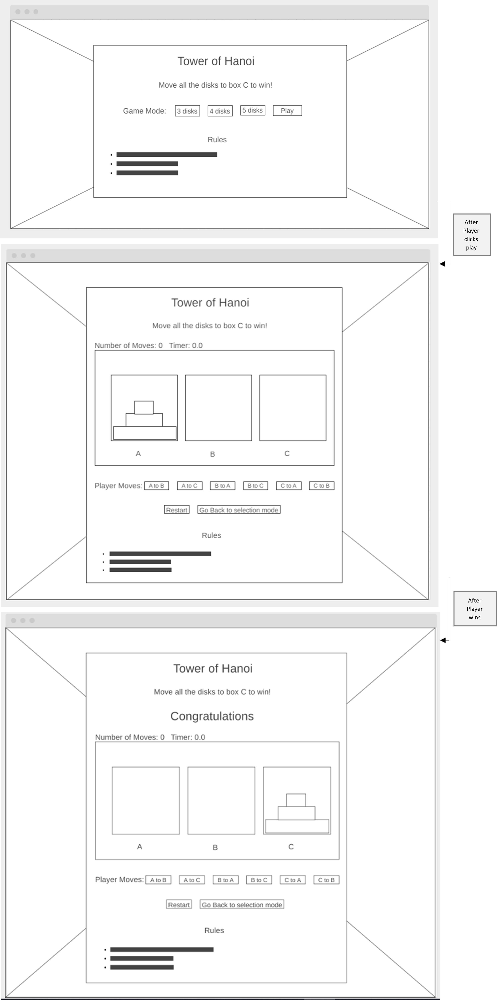

# Tower-of-Hanoi
Tower of Hanoi game using html, CSS, and JavaScript.
[Link to the game in GitHub pages.](https://pages.git.generalassemb.ly/fatimah-al-ibrahim/Tower-of-Hanoi/)

## Game introduction
In the Tower of Hanoi game, you will have 3 boxes and several disks. The goal is to move all the disks to the last box while following the provided rules.

## Technologies used
* Html5
* CSS
* jQuery Core 3.5.1 
* jQuery UI 1.12.1
* Git Bash and GitHub

## Wireframes and user stories

### Wireframe: 


### User Stories:
* As a player, I want to know the win condition, so that I have a goal in mind while playing.
* As a player, I want to be able to choose the game mode, so that I can play the game in the mode I want.
* As a player, I want to be able to determine when to play the game, so that I start it when I am ready.
* As a player, I want to be able to select my actions, so that I can choose the appropriate actions to win the game.
* As a player, I want to be able to know the number of moves I took to complete the game, so that I can assess my play.
* As a player, I want to be able to know how long I took to complete the game, so that I can assess my play.
* As a player, I want to be able to restart the game, so that I can restart it whenever I need to.
* As a player, I want to be able to go back to mode selection, so that I can choose another mode if I changed my mind or chose a wrong mode by mistake.
* As a player, I want to be able to see the game rules all the time, so that I can view them whenever I forget anything.

## Development process and problem-solving strategy
### Development process
1. Chose the game type.
1. Created the html, CSS, and JavaScript files.
1. Created a wireframe for the website using [wireframe.cc](https://wireframe.cc/).
1. Created the user stories based on the wireframe.
1. Added the initial html and CSS code.
1. Added the jQuery code for the user stories functionalities, one at a time.
1. Added an audio that will play when the player wins taken from [source](https://youtu.be/1ZsiEPoRCOs?t=3).
1. Added the final CSS code.
1. Created a custom alert box using jQuery UI dialog.
### Problem-solving strategy
* For syntax problems: search Google.
* For game logic problem: take time to think about how to implement the desired functionality.

## Unsolved problems
There are no unsolved problems

## Winner logic
The player will win when all the disks are in box C. <br>
The player can't lose in Tower of Hanoi, bacause there will alwayes be at least one possible move.

## Favorite functions process
``` JavaScript
// on click for the player action buttons
$("#player-moves button").on("click",function(){
    var action = $(this).text(); // get the action that the player selected
    var current = action[5]; // get the starting box id (ex. A)
    var destination = action[10]; // get the destination box id (ex .B)
    var currentTopDisk = $("#box-"+current+" div").first(); // get the top disk from the starting box

    if(currentTopDisk.length == 0){ // check if the starting box is empty or not
        $("#custom-alert").html("<p>There is nothing to move from "+current+"</p>"); // if the starting box is empty, inform the player
        $("#custom-alert").dialog({width:'auto' , classes: {"ui-dialog-titlebar": "dialog-title"}}); //open the dialog with "dialog-title" class for the title
    }
    else{
        var destinationTopDisk = $("#box-"+destination+" div").first(); // get the top box from the destination box
        if(destinationTopDisk.length == 0){ // check if the destination box is empty or not
            $("#box-"+current).remove(currentTopDisk); // remove the top disk of the starting box
            $("#box-"+destination).prepend(currentTopDisk); // add the top box from the starting box to be the top of the destination box
            var moves = Number($("#number-of-moves").text()); // get the number of moves the player performed before this one
            $("#number-of-moves").text(++moves); // increase the number of moves by one
            checkVictory(); // call the function to check if the player won
        }
        else{
            if(currentTopDisk.attr("class") < destinationTopDisk.attr("class")){ // check if the top disk from the starting box is smaller than the top disk from the destination box
                $("#box-"+current).remove(currentTopDisk); // remove the top disk of the starting box
                $("#box-"+destination).prepend(currentTopDisk); // add the top box from the starting box to be the top of the destination box
                var moves = Number($("#number-of-moves").text()); // get the number of moves the player performed before this one
                $("#number-of-moves").text(++moves); // increase the number of moves by one
                checkVictory(); // call the function to check if the player won
            }
            else{
                $("#custom-alert").html("<p>You can't move a bigger disk on top of a smaller one</p>"); // remind the player of the rule
                $("#custom-alert").dialog({width:'auto' , classes: {"ui-dialog-titlebar": "dialog-title"}}); //open the dialog with "dialog-title" class for the title
            }
        }  
    }
});
```
### Function explanation
This function will be called after the player clicks on any of the player moves buttons: <br>
1. The function gets the desired move from the clicked button's text and stores it into the variable action.
1. It will extract the starting and the destination boxes from variable action using string indexes.
1. It will get the top disk from the starting box.
1. It will check if the starting box is empty or not using the top disk it got previously.
    * If it is empty: the function will inform the user of this fact by using the dialog box.
    * If it is not empty: the function will repeat the checking process with the destination box.
1. If the destination box is empty: the function will remove the top disk from the starting box and append it to the top (beginning) of the destination box, increase the moves by one, and check if the player one by calling the `checkVictory` function
1. If the destination box is not empty: the function will compare the top disks of the starting and destination boxes to make sure that the starting box top disk is smaller.
	* If it is smaller: the function will remove the top disk from the starting box and append it to the top (beginning) of the destination box, increase the moves by one, and check if the player one by calling the `checkVictory` function
	* If it is not smaller: then the function will not perform the move and inform the user of the violated rule using the dialog box.
