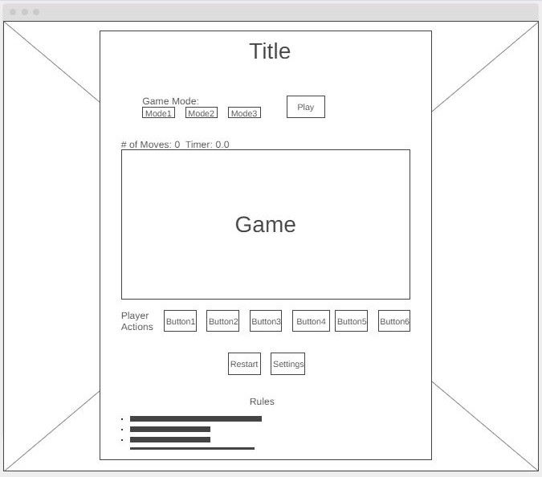

# Tower-of-Hanoi
Tower of Hanoi game using html, CSS, and JavaScript.

## Technologies used

## Wireframes and user stories

### Wireframe: 

### User Stories:
* As a player, I want to be able to choose the game mode, so that I can play the game in the mode I want.
* As a player, I want to be able to determine when to play the game, so that I start it when I am ready.
* As a player, I want to be able to select my actions, so that I can choose the appropriate actions to win the game.
* As a player, I want to be able to know the number of moves I took to complete the game, so that I can assess my play.
* As a player, I want to be able to know how long I took to complete the game, so that I can assess my play.
* As a player, I want to be able to restart the game, so that I restart it whenever I need to.
* As a player, I want to be able to change the game mode during play time, so that I choose another mode if I changed my mind or Chose a wrong mode by mistake.
* As a player, I want to be able to see the game rules all the time, so that I can view them whenever I forget anything.

## Development process and problem-solving strategy
1. Created the html, CSS, and JavaScript files.
1. Created a wireframe for the website using [wireframe.cc](https://wireframe.cc/).
1. Created the user stories based on the wireframe.

## Unsolved problems

## Winner logic

## Favorite functions process
